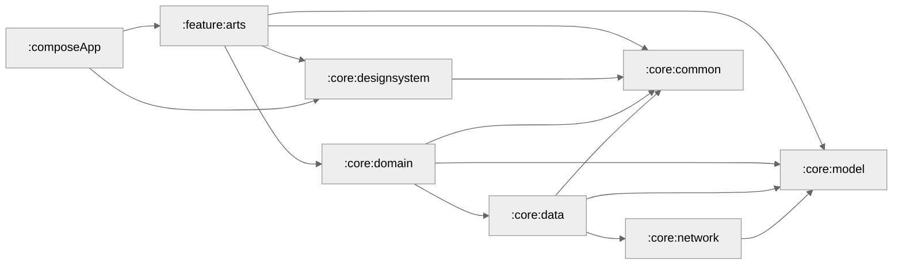

[](https://github.com/fethij/Rijksmuseum/actions/workflows/deploy.yaml)


# Rijksmuseum


Rijksmuseum is multi-modular Kotlin and Compose Multiplatform app that offers an immersive way to explore the art collection of the renowned Rijksmuseum in Amsterdam.


## Download

<a href='https://play.google.com/store/apps/details?id=com.tewelde.rijksmuseum&utm_source=github'></a>


## Design
Design is inspired by [Mari Andrianova](https://dribbble.com/shots/20446337-Gallery-of-art-App).

### iOS


### Android


### Desktop


### Wasm


## Tech Stack 📚
- [Kotlin Multiplatform](https://kotlinlang.org/lp/multiplatform/)
- [Compose Multiplatform](https://www.jetbrains.com/lp/compose-multiplatform/)
- [Kotlin Coroutines](https://github.com/Kotlin/kotlinx.coroutines)
- [Koin](https://insert-koin.io/)
- [Coil](https://coil-kt.github.io/coil/)
- [Ktor](https://ktor.io/)
- [Compose Navigation](https://developer.android.com/develop/ui/compose/navigation)
- [Jetpack Lifecycle](https://developer.android.com/jetpack/androidx/releases/lifecycle)
- [Jetpack ViewModel](https://developer.android.com/topic/libraries/architecture/viewmodel)


## Development :gear:

The app uses Rijksmuseum API, hence you need to get your own API key from [here](https://data.rijksmuseum.nl/object-metadata/api/).
Make sure to add your key to `secrets.properties` file.
In order to sign your builds generate `rijksmuseum.jks` keystore and add keystore password, alias and store password in `secrets.properties`.

secrets.properties would look like this:
```
rijksmuseum.api.key=#Add your Rijksmuseum api key
rijksmuseum.keystore.password=#Add your keystore password
rijksmuseum.key.alias=#Add your key alias
rijksmuseum.key.password=#Add your key password
```

### Module Graph


