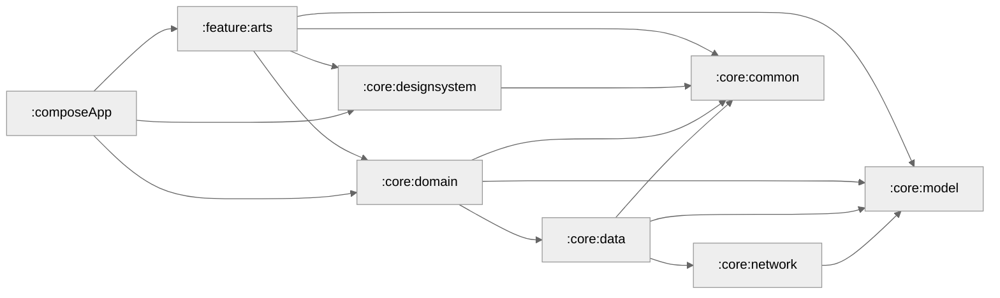

# Rijksmuseum

Rijksmuseum is a multiplatform app using the Rijksmuseum [rich and freely accessible content](https://www.rijksmuseum.nl/en/data/policy) api. 
You can filter arts based on location.

Rijksmuseum is a multiplatform app built using Kotlin and Compose Multiplatform. It features an nice
user interface and experience to browse through arts.

## Design
Design is inspired by [Mari Andrianova](https://dribbble.com/shots/20446337-Gallery-of-art-App).

### iOS

### Android

### Desktop

### Wasm

## Tech Stack 📚
- [Kotlin Multiplatform](https://kotlinlang.org/lp/multiplatform/)
- [Compose Multiplatform](https://www.jetbrains.com/lp/compose-multiplatform/)
- [Kotlin Coroutines](https://github.com/Kotlin/kotlinx.coroutines)
- [Koin](https://insert-koin.io/)
- [Coil](https://coil-kt.github.io/coil/)
- [Ktor](https://ktor.io/)
- [Compose Navigation](https://developer.android.com/develop/ui/compose/navigation)
- [Jetpack Lifecycle](https://developer.android.com/jetpack/androidx/releases/lifecycle)
- [Jetpack ViewModel](https://developer.android.com/topic/libraries/architecture/viewmodel)

## Development 🛠️

You can just clone the repo and build it locally without requiring any changes. 

Get your own Api Key from [Rijksmuseum.nl](https://data.rijksmuseum.nl/object-metadata/api/).

Project requires JDK 17+, and based on the AGP version defined in [`libs.versions.toml`](/gradle/libs.versions.toml) file, 
you can use appropriate Android Studio/Fleet to import the project.

### Module Graph

